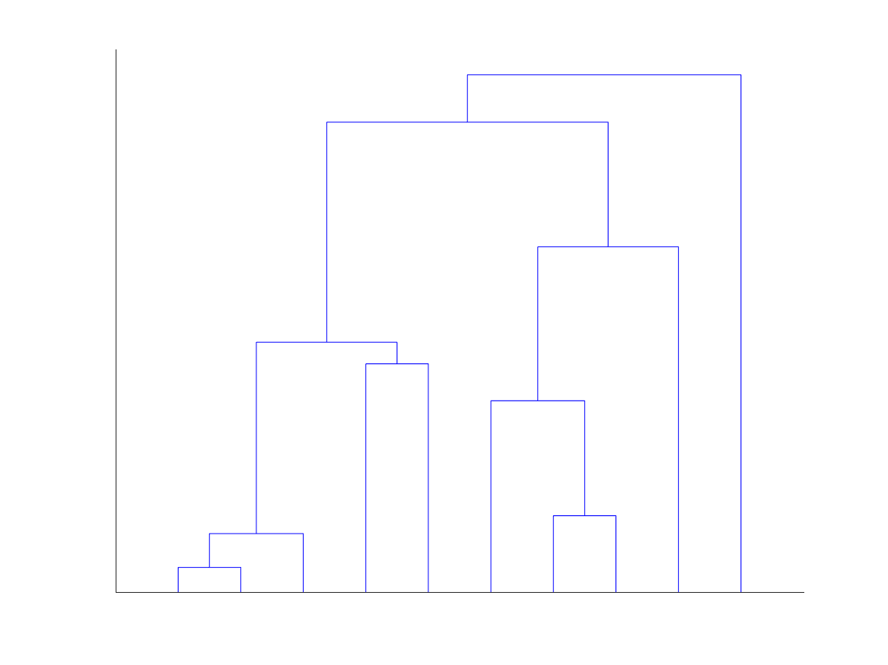

[](http://quantlet.de/)

## [](http://quantlet.de/) **HC_example** [](http://quantlet.de/)

```yaml

Name of Quantlet: 'HC_example'

Published in: 'Quantinar'

Description: 'Give an example using hierarchical clustering to choose number of clusters in minimun spanning tree.'

Submitted:  '18 Oct 2022'

Keywords: 
- 'Minimum Spaning Tree'
- 'Hierarchical clustering'

Author: 
- 'Zijin Wang'
- 'Wolfgang Karl Härdle'
- 'Rui Ren'

```



### MATLAB Code
```matlab

%% Hierarchical Clustering example of cluster number as 10
clc,clear
load("sp500.mat");
logret=sample(:,4);
timeline=datenum(sample(:,1:3));
DM=pdist2(logret,logret);
for i=1:length(DM)-2
    for j=i+2:length(DM)
        DM(i,j)=inf;
    end
end
for j=1:length(DM)-2
    for i=j+2:length(DM)
        DM(i,j)=inf;
    end
end
%% generate hierarchical clustering
Z=linkage(squareform(DM));% default is singleton
%% set cluster number as 10
figure;[~,T]=dendrogram(Z,10);
set(gca,'color','none','ytick',[],'yticklabel',[],'xtick',[],'xticklabel',[]);
saveas(gcf,'HierarchicalExample','png');
```

automatically created on 2022-10-21