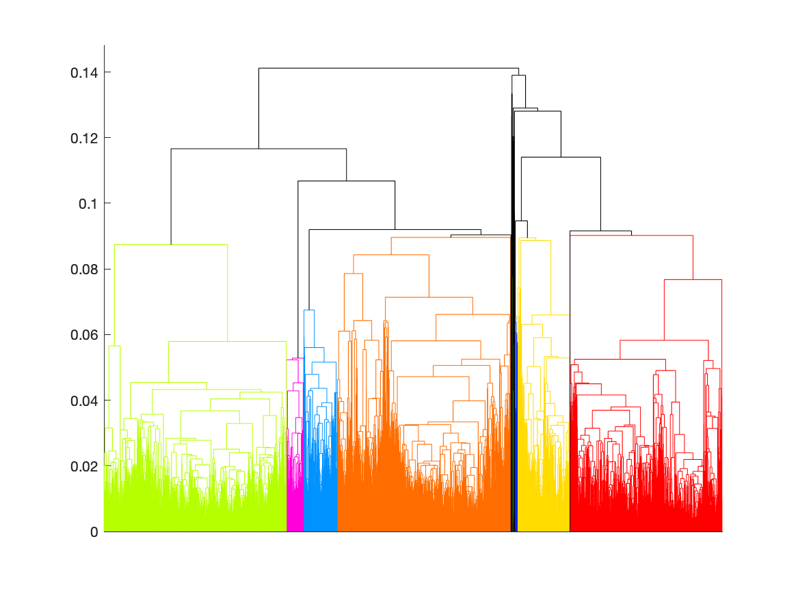

[](http://quantlet.de/)

## [](http://quantlet.de/) **HC_sp500** [](http://quantlet.de/)

```yaml

Name of Quantlet: 'HC_sp500'

Published in: 'Quantinar'

Description: 'Give an example of using hierarchical clustering to illustrate how to choose the number of clusters by minimum spanning tree. The data set is S&P 500 index.'

Submitted:  '18 Oct 2022'

Keywords: 
- 'Minimum Spaning Tree'
- 'Hierarchical clustering'
- 'S&P 500 index'

Author: 
- 'Zijin Wang'
- 'Wolfgang Karl Härdle'
- 'Rui Ren'

```



### MATLAB Code
```matlab

%% SP500 by Hierarchical Clustering
% to produce dendrogram
% treat every date as a node
clc,clear
load("sp500.mat");
logret=sample(:,4);
timeline=datenum(sample(:,1:3));
DM=pdist2(logret,logret);
for i=1:length(DM)-2
    for j=i+2:length(DM)
        DM(i,j)=inf;
    end
end
for j=1:length(DM)-2
    for i=j+2:length(DM)
        DM(i,j)=inf;
    end
end
%% generate hierarchical clustering
Z=linkage(squareform(DM));% default is singleton
%% plot hierarchical clustering K=20
K=20;
figure;
[H,T,outperm]=dendrogram(Z,0,"ColorThreshold",Z(end-K+2,3),"Reorder",1:length(Z)+1);
set(gca,'xtick',[],'xticklabel',[]);
dateaxis('x',12)
%% save hierarchical clustering K=20
saveas(gcf,'Hierarchical_sp500','png')

```

automatically created on 2022-10-21