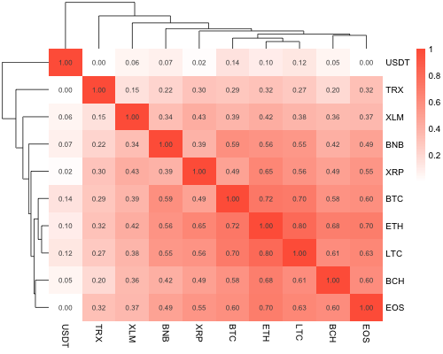
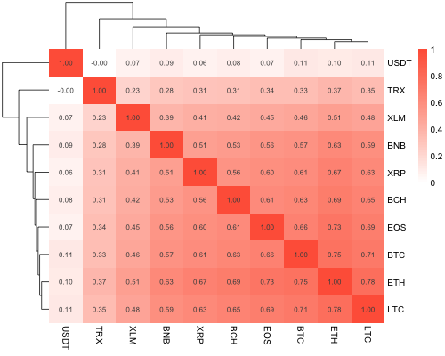

[](http://quantlet.de/)

## [](http://quantlet.de/) **MSTCC_DisMtx** [](http://quantlet.de/)

```yaml

Name of Quantlet: 'MSTCC_DisMtx'

Published in: 'Quantinar'

Description: 'Give distance matrix for minimum spanning tree using 10 cryptocurrencies.'

Submitted:  '18 Oct 2022'

Keywords: 
- 'Minimum Spaning Tree'
- 'Distance matrix'
- 'Cryptocurrency'

Author: 
- 'Zijin Wang'
- 'Wolfgang Karl Härdle'
- 'Rui Ren'

```






### R Code
```r

# codes originate from Giudici P, et al. (2020). "Network Models to Enhance Automated Cryptocurrency Portfolio Management."

rm(list = ls())

library(PerformanceAnalytics)
library(xts)
library(quantmod)
library(timeSeries)
library(xtable)
library(igraph)
library(tcltk2)
library(MTS)
library(matrixcalc)
library(Matrix)
library(fPortfolio)
library(IntroCompFinR)  #install.packages("IntroCompFinR", repos="http://R-Forge.R-project.org")
require(quadprog)
library(pracma)
library(glasso)

setwd("~/Documents/METIS/Minimum Spanning Tree/Codes/MSTCC_DisMtx")
prices<-read.table("def.csv", header=TRUE, sep=",", dec=".")
ZOO <- zoo(prices[,-1], order.by=as.Date(as.character(prices$Date), format='%m/%d/%Y'))

#return
return<- Return.calculate(ZOO, method="log")
return<- return[-1, ]
returnstd<-xts(return)
class(return)
dim(return)

# distance matrix from Sep14, 2017 to Oct 17, 2019
# Random Matrix Theory
ciao_whole<-list()
M_whole<-matrix(rnorm(10*770, mean=0,sd=1),10,770)
E_whole<-t(M_whole)
O_whole<-M_whole%*%E_whole
L_whole<-1/770
R_whole<-L_whole*O_whole
eigen(R_whole, symmetric = TRUE)
eigen_R<-eigen(R_whole, symmetric = TRUE)$values
Q_whole<-770/10
lambda_max<-(1+1/Q_whole+2*sqrt(1/Q_whole))   ##taking into account the behaviour of the first eigenvalue
lambda_max
# correlation matrix
C_whole<-cor(returnstd)                        # correlation matrix
# draw heatmap of filtered correlation matrix of the whole time
png("CorMtx_whole.png",width = 500,height = 400,bg="transparent")
mycol<-colorRampPalette(c("white","tomato"))(100)
pheatmap(C_whole,cluster_rows = T,cluster_cols = T,border = F,display_numbers = T,color = mycol)
dev.off()
# eigenvalues and eigenvectors of correlation matrix
lambda_C_whole<-eigen(C_whole,symmetric = T)   # eigenvalue and eigenvector of correlation matrix
eigen_C_whole<-lambda_C_whole$values           # eigenvalue of correlation matrix
eigenvec_C_whole<-lambda_C_whole$vectors       # eigenvector of correlation matrix
for(i in 1:10){if(eigen_C_whole[i]<lambda_max){eigen_C_whole[i]=0} # sort "eigen_C_whole" by ascent
  eigen_C_whole<-sort(eigen_C_whole)                             # I think we do NOT need to sort
}
filtered_diagonal_C_whole<-diag(eigen_C_whole)           # filtered diagnal matrix of eigenvalue
V_whole<-eigenvec_C_whole                                # eigenvector from 10 to 1
V_whole<-eigenvec_C_whole[,10:1]                         # I think we do NOT need to sort from 10 to 1
f_whole<-t(V_whole)                                      # transport of V_whole
# filtered correlation matrix
C_1_whole<-V_whole%*%filtered_diagonal_C_whole%*%f_whole # filtered correlation matrix
diag(C_1_whole)<-1                                       # diagonal of filtered correlation matrix is no more 1 so have to sign 1 to diagonal 
C_1_whole<-as.matrix(C_1_whole)
diag(C_1_whole)<-1
colnames(C_1_whole)<-colnames(returnstd)
rownames(C_1_whole)<-colnames(returnstd)
# draw heatmap of filtered correlation matrix of the whole time
png("FiltCorMtx_whole.png",width = 500,height = 400,bg="transparent")
mycol<-colorRampPalette(c("white","tomato"))(100)
pheatmap(C_1_whole,cluster_rows = T,cluster_cols = T,border = F,display_numbers = T,color = mycol)
dev.off()
# distance matrix
Dist_whole<-sqrt(2-2*C_1_whole)                          # distance matrix
Dist_whole<-as.matrix(Dist_whole)
Dist_whole[is.nan(Dist_whole)]<-0                        # why nan? I think it may be set as inf, anywhere it cannot be nan
colnames(Dist_whole)<-colnames(returnstd)
rownames(Dist_whole)<-colnames(returnstd)
# draw heatmap of distance matrix of the whole time
png("DistMtx_whole.png",width = 500,height = 400,bg="transparent")
mycol<-colorRampPalette(c("white","tomato"))(100)
pheatmap(Dist_whole,cluster_rows=T,cluster_cols=T,border = F,display_numbers = T,color = mycol)
dev.off()


```

automatically created on 2022-10-21