[](http://quantlet.de/)

## [](http://quantlet.de/) **MSTvsHC_sp500** [](http://quantlet.de/)

```yaml

Name of Quantlet: 'MSTvsHC_sp500'

Published in: 'Quantinar'

Description: 'Show the evolution of minimum spanning tree using varying time window.'

Submitted:  '18 Oct 2022'

Keywords: 
- 'Minimum Spaning Tree'
- 'Cryptocurrency'

Author: 
- 'Zijin Wang'
- 'Wolfgang Karl Härdle'
- 'Rui Ren'

```

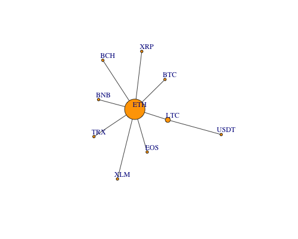

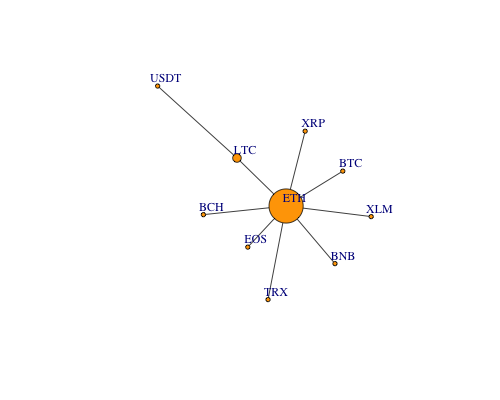

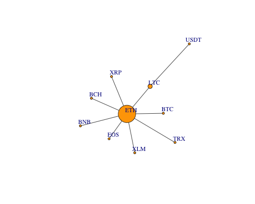

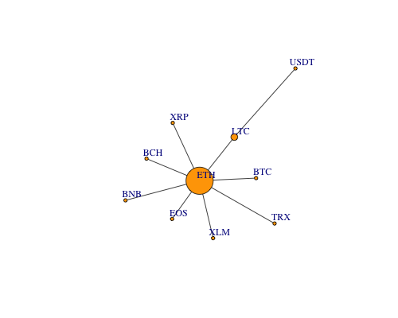

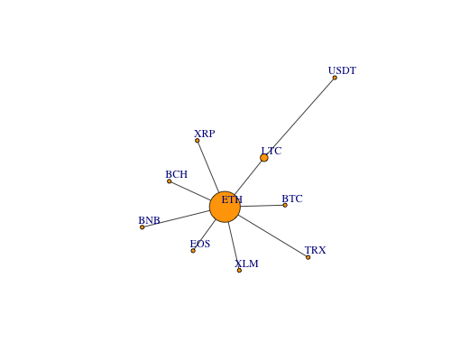

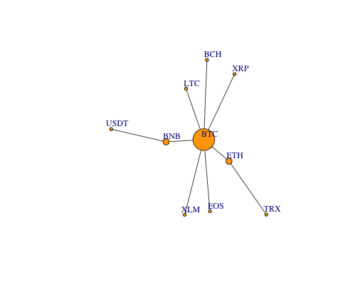

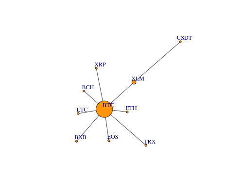

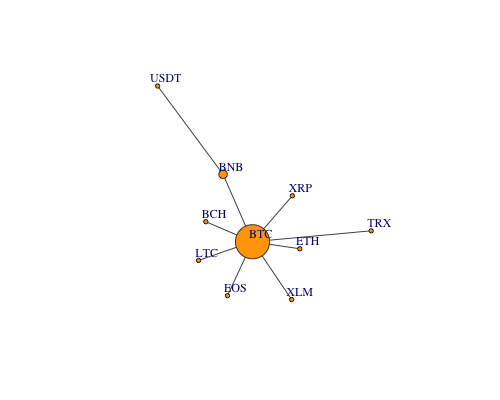

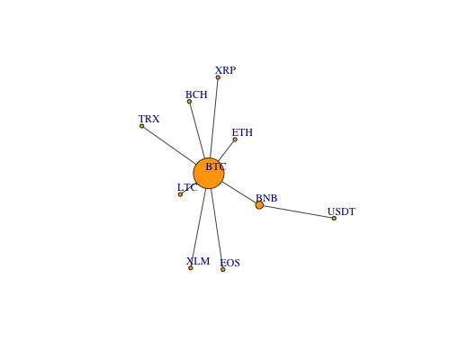

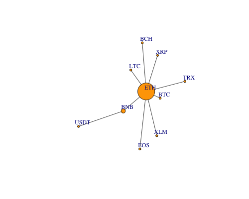


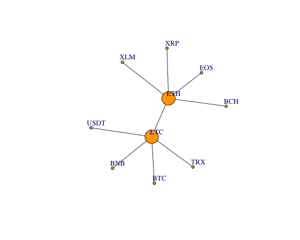

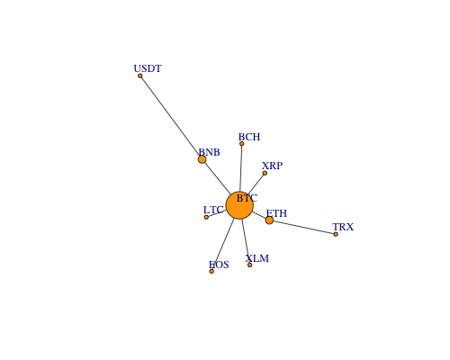

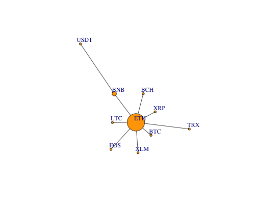

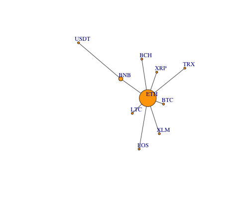

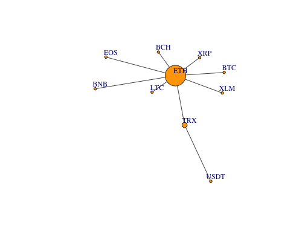


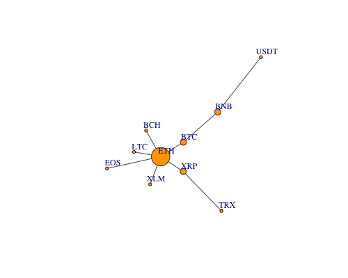

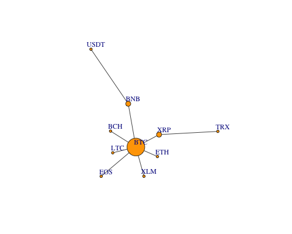

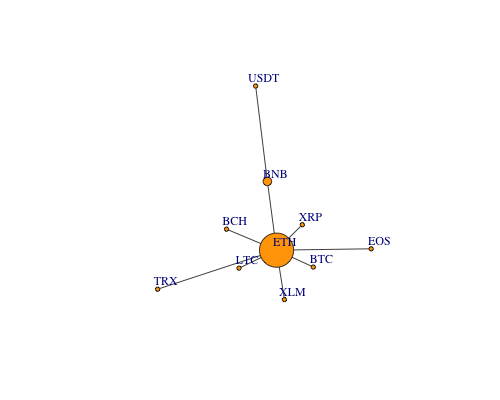

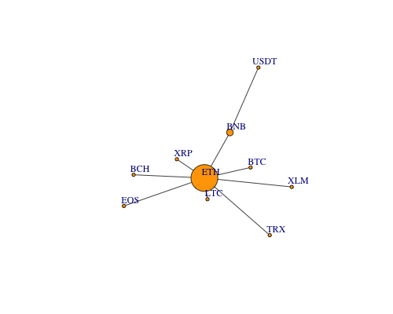


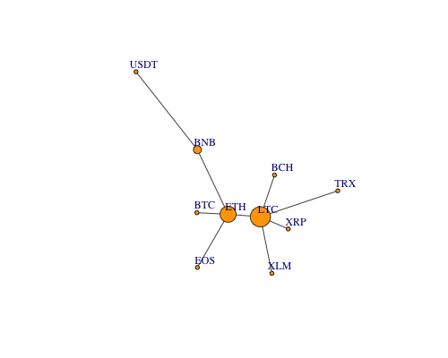

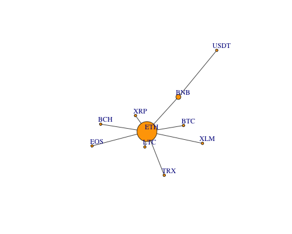

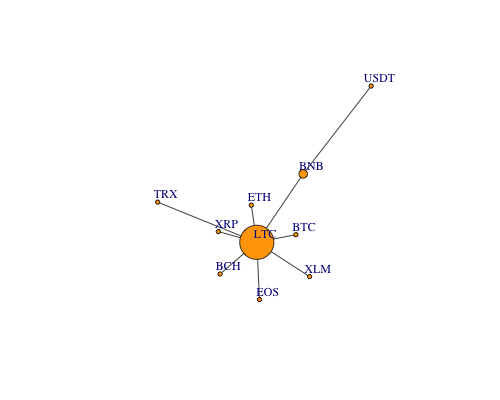

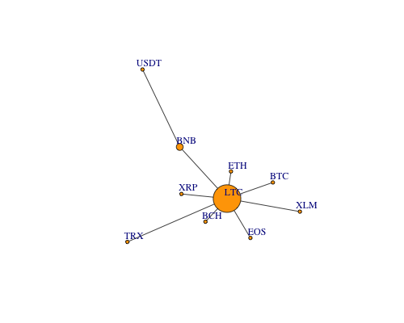

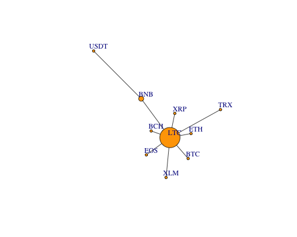

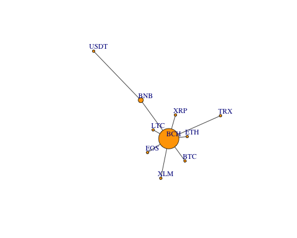

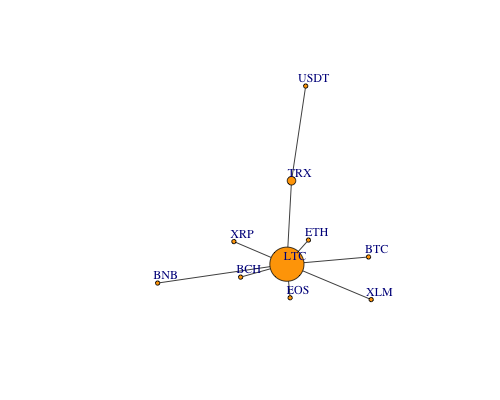


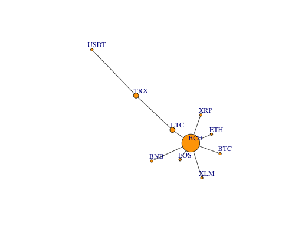

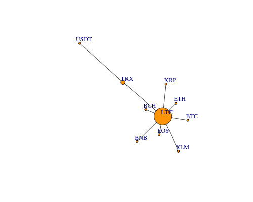

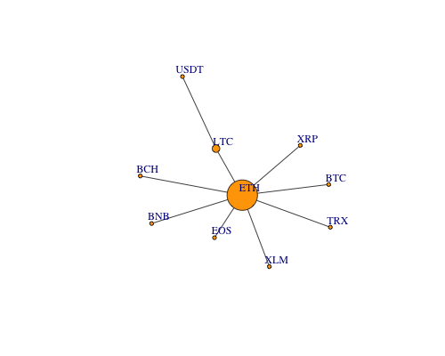


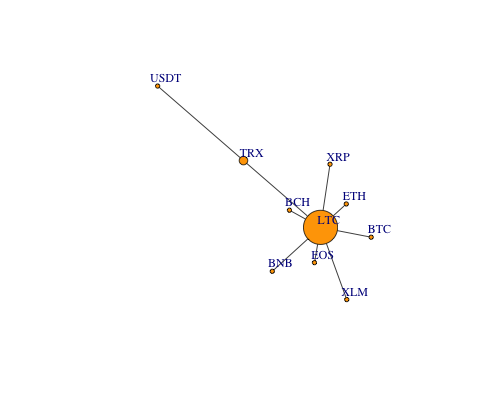


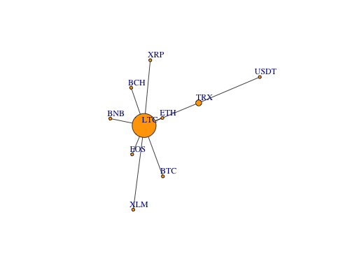


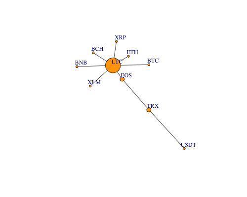

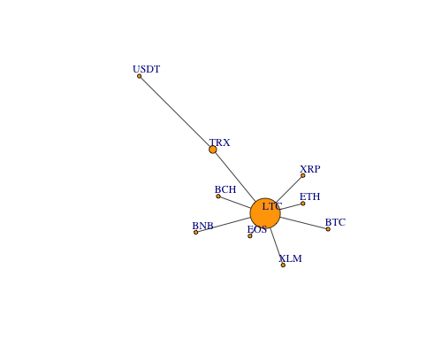

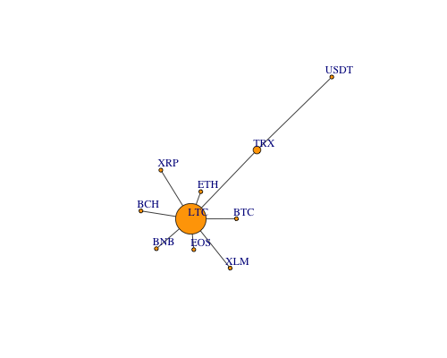

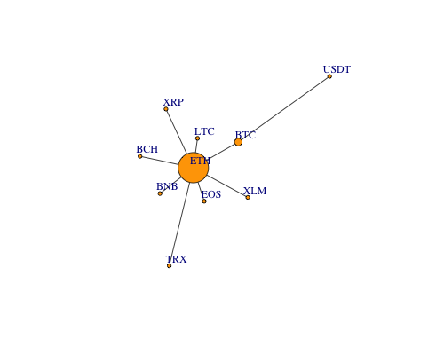


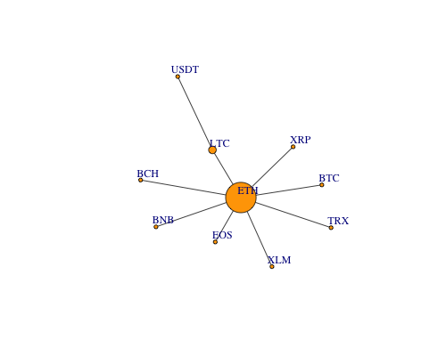

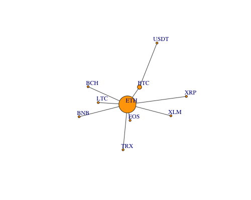

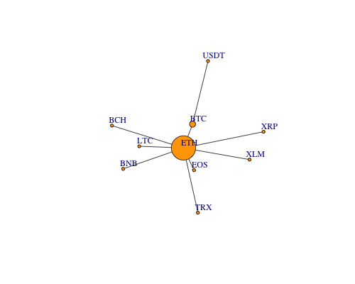

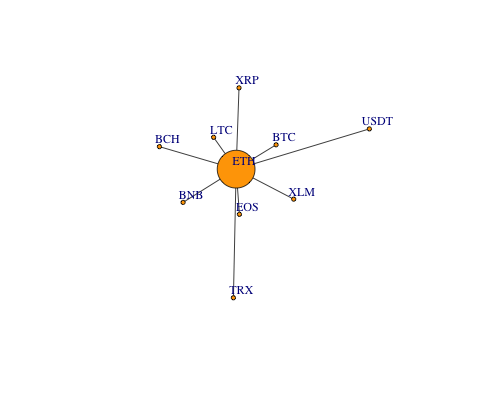

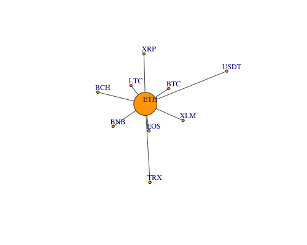

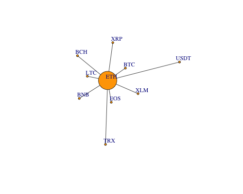


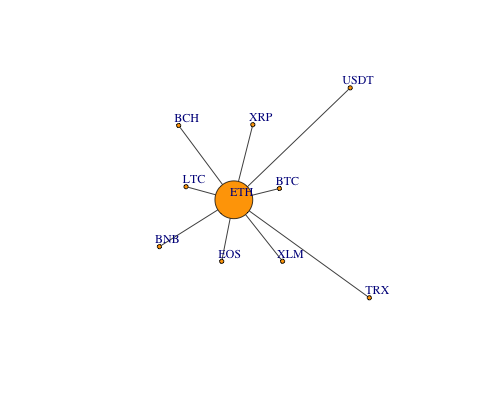

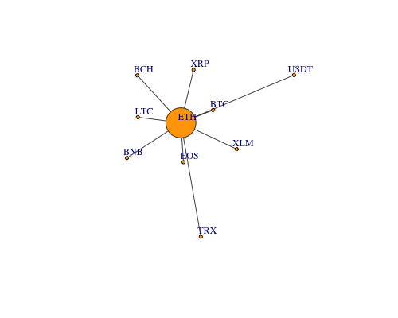


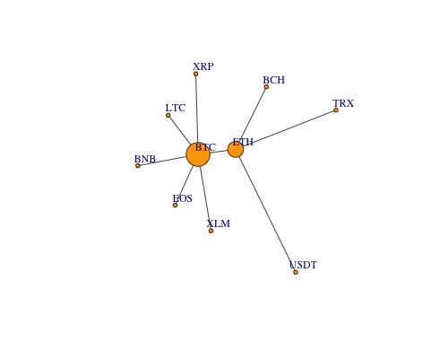


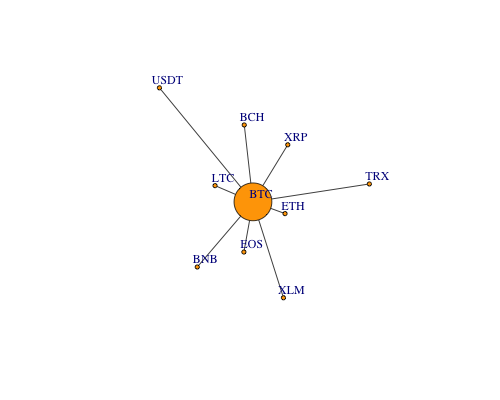


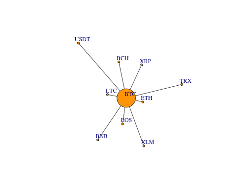

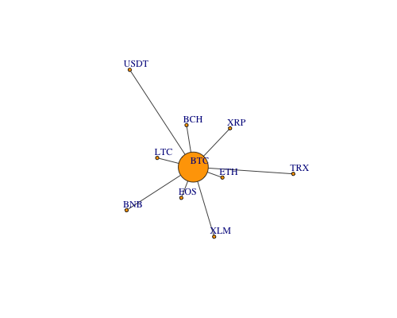


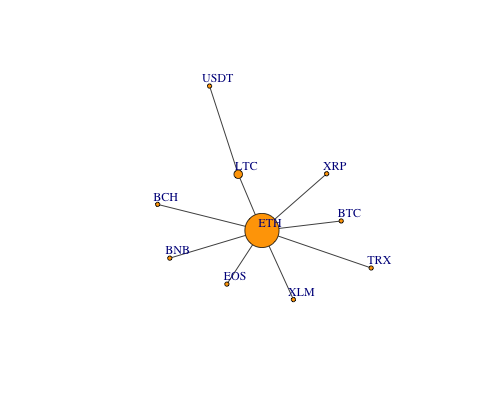


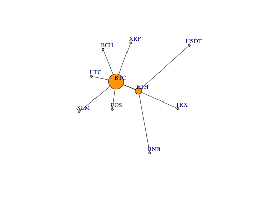

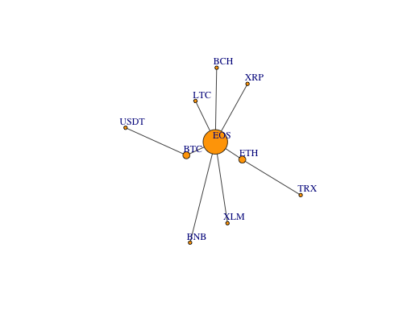


