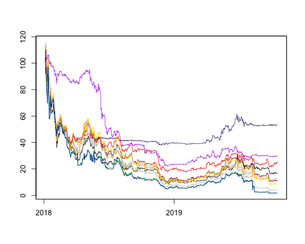

[](http://quantlet.de/)

## [](http://quantlet.de/) **MSTCC_PortfolioReturns** [](http://quantlet.de/)

```yaml

Name of Quantlet: 'MSTCC_PortfolioReturns'

Published in: 'Quantinar'

Description: 'Show the portfolio performance, one of which is constructed by minimum spanning tree.'

Submitted:  '18 Oct 2022'

Keywords: 
- 'Minimum Spaning Tree'
- 'Portfolio construction'

Author: 
- 'Zijin Wang'
- 'Wolfgang Karl Härdle'
- 'Rui Ren'

```




### R Code
```r

# codes originate from Giudici P, et al. (2020). "Network Models to Enhance Automated Cryptocurrency Portfolio Management."

rm(list = ls())

setwd("~/Documents/METIS/Minimum Spanning Tree/Codes/MSTCC_PortfolioValue")

#Plot returns
prezzi<-read.table("rend100_crypto.csv", header=TRUE, sep=",", dec=".")
ZOO <- zoo(prezzi[,-1], order.by=as.Date(as.character(prezzi$Date), format='%m/%d/%Y'))

png("MSTCC_PortRet1.png", width=500, height=400, bg = "transparent")
plot(ZOO, screens=1, col=c("black", "lightblue", "orange","darkslateblue","red","brown", "gold", "grey", "green", "blue3","darkorchid2"), ylab="", xlab="")
dev.off()
#dev.new()
png("MSTCC_PortRet2.png", width=500, height=400, bg = "transparent")
plot(ZOO[,c(1,2,3,4,11)], screens=1, col=c("black", "lightblue", "orange","darkslateblue", "darkorchid2"), lwd=1, ylab="", xlab="")
dev.off()


```

automatically created on 2022-10-21