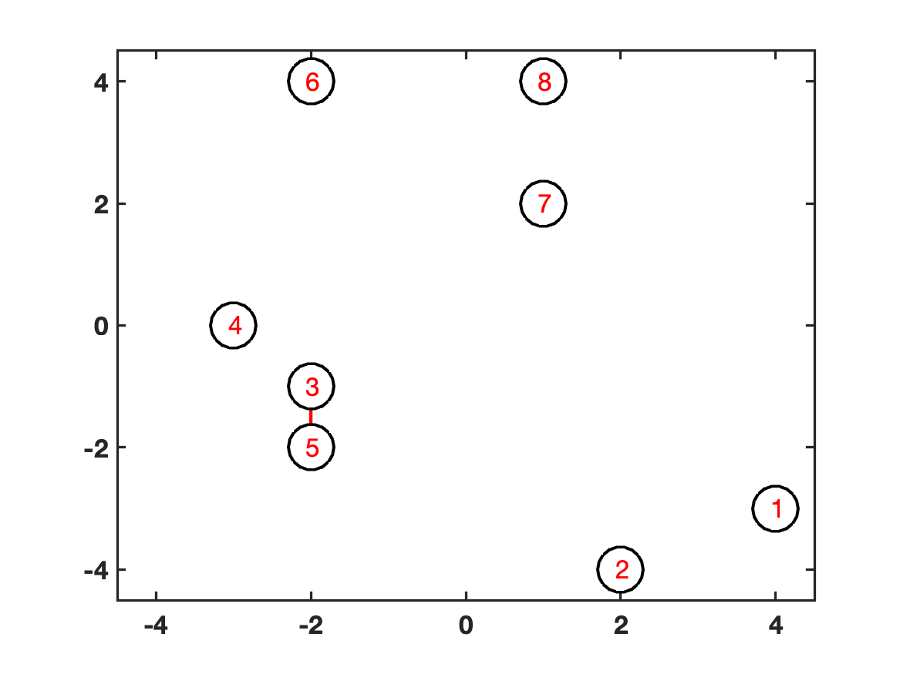
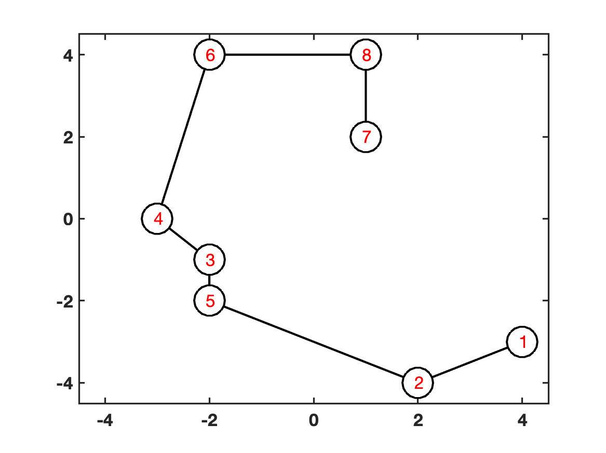
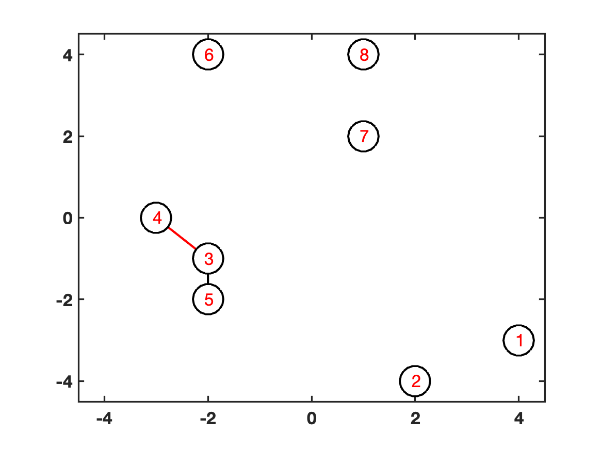
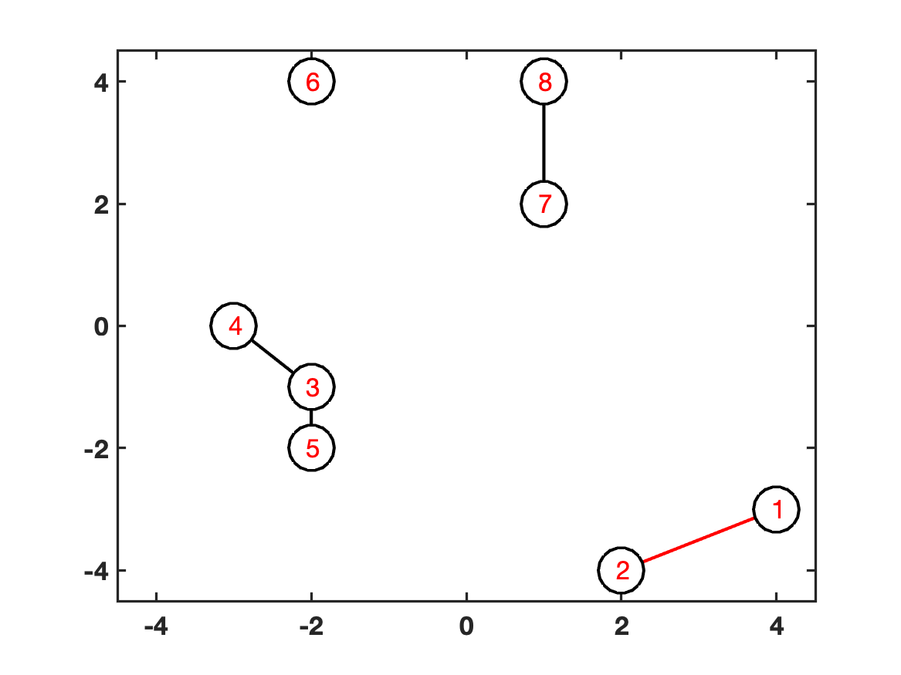
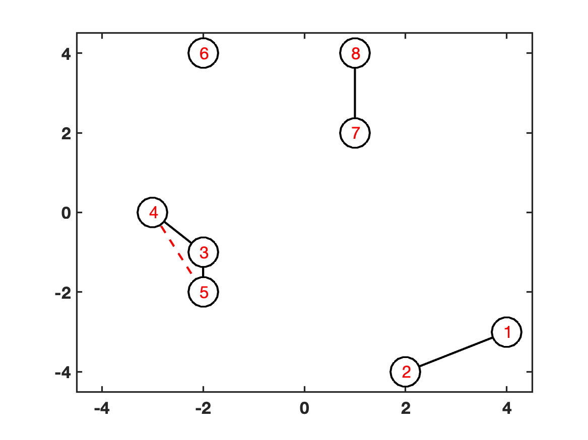
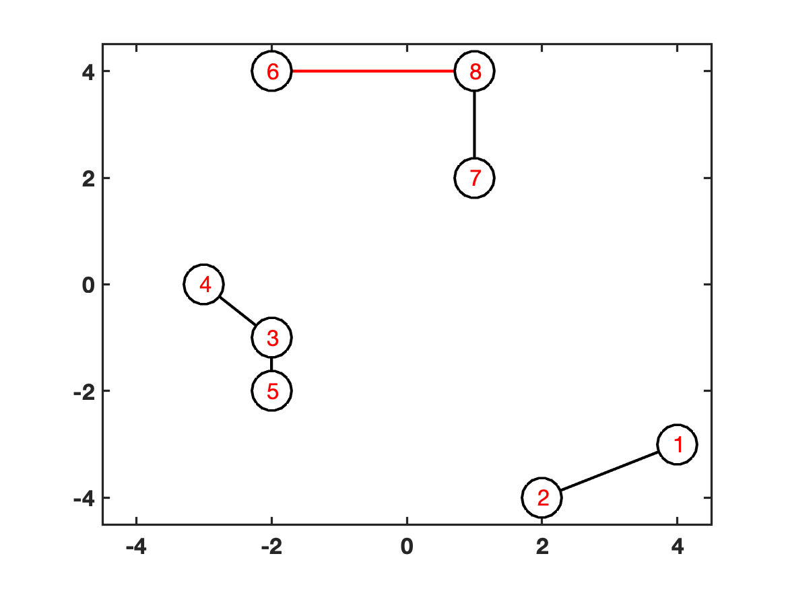
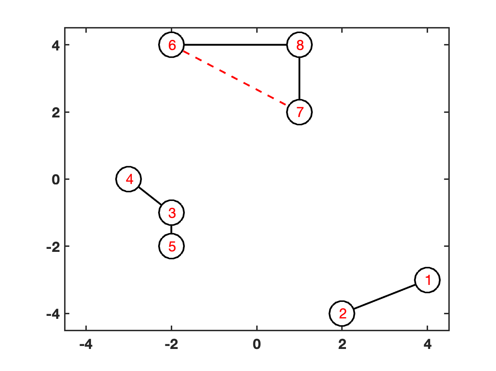
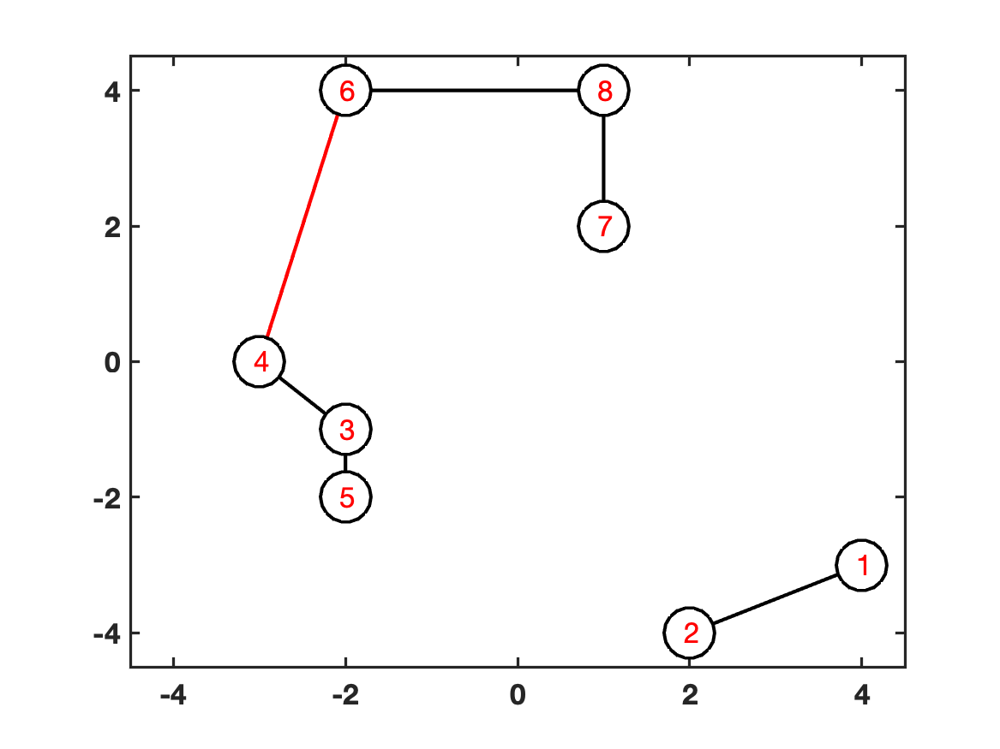
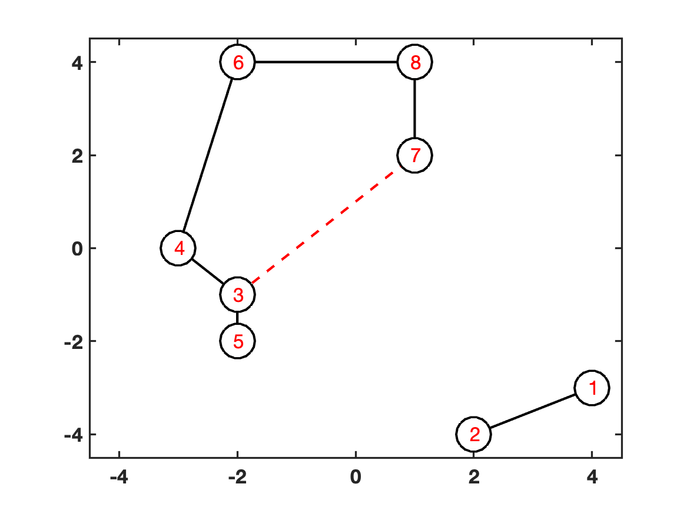

[](http://quantlet.de/)

## [](http://quantlet.de/) **MST_8p** [](http://quantlet.de/)

```yaml

Name of Quantlet: 'MST_8p'

Published in: 'Quantinar'

Description: 'Give an example of 8 points to constuct MST .'

Submitted:  '18 Oct 2022'

Keywords: 
- 'Minimum Spaning Tree'
- 'Distance'

Output:  
- 'MST_8p_gen_1.png'
- 'MST_8p_gen_2.png'
- 'MST_8p_gen_3.png'
- 'MST_8p_gen_4.png'
- 'MST_8p_gen_5.png'
- 'MST_8p_gen_6.png'
- 'MST_8p_gen_7.png'
- 'MST_8p_gen_8.png'
- 'MST_8p_gen_9.png'
- 'MST_8p_gen_10.png'
- 'MST_8p_gen_11.png'

Author: 
- 'Zijin Wang'
- 'Wolfgang Karl Härdle'
- 'Rui Ren'

```





















### MATLAB Code
```matlab

%% MST of Kruskal: an 8-points example

%% calculate MST
P=[-3, -2, -2, -2, 1, 1, 2, 4;0, 4, -1, -2, 4, 2, -4, -3]';
P = P([8, 7, 3, 1, 4, 2, 6, 5], :);
DM=pdist2(P,P);
DM2=DM.^2;
t=mst(DM);
%% plot 8 points
figure;
scatter(P(:,1),P(:,2),800,'k','LineWidth',2,'MarkerFaceColor','auto');hold on
text(P(:,1)-0.07,P(:,2),char(num2str((1:8)')),'Color','r','FontSize',16)
box on
xlim([-4.5,4.5]);
ylim([-4.5,4.5]);
ylabel("brand loyalty","FontWeight","bold","FontSize",16);
xlabel("price conciousness","FontWeight","bold","FontSize",16);
set(gca, 'LineWidth', 1.6, 'FontSize', 16, 'FontWeight', 'Bold'...
    ,'XTick',-4:2:4,'YTick',-4:2:4);
saveas(gcf,'MST_8p','png');
%% plot 7 steps of kruskal algorithm
for j=1:7
    figure;
    for i = 1 : j
        plot([P(t(i,1),1),P(t(i,2),1)],[P(t(i,1),2),P(t(i,2),2)],'k-','LineWidth',2);hold on
    end
    scatter(P(:,1),P(:,2),800,'k','LineWidth',2,'MarkerFaceColor','auto');
    text(P(:,1)-0.07,P(:,2),char(num2str((1:8)')),'Color','r','FontSize',16)
    box on
    xlim([-4.5,4.5]);
    ylim([-4.5,4.5]);
    ylabel("brand loyalty","FontWeight","bold","FontSize",16);
    xlabel("price conciousness","FontWeight","bold","FontSize",16);
    set(gca, 'LineWidth', 1.6, 'FontSize', 16, 'FontWeight', 'Bold'...
        ,'XTick',-4:2:4,'YTick',-4:2:4);
    saveas(gcf,['MST_8p_',num2str(j)],'png')
end

function retval = mst(x)
% Algorithm generates minimum spanning tree
% The rsult is presentes as a set of links between nodes
%
% Author: Janusz Miśkiewicz, email: jamis@ift.uni.wroc.pl
[n,~]=size(x);
x=triu(x,1);
net=zeros(n-1,3);
onnet=zeros(n,1);
klaster=zeros(n,1);
klast=0;
licz=0;
%check if the matrics is symmetric and positive
maxx=max(max(x));
smax=10*abs(maxx);
x(x==0)=smax;
while (licz<n-1)
  minx=min(min(x));
  [i,j]=find(x<=minx);
  if (~isempty(i)) 
    ii=i(1);
    jj=j(1);
    i=ii;
    j=jj;
  end
  if (onnet(i) ==0 && onnet(j) ==0)
    licz=licz+1;
    net(licz,1)=i;
    net(licz,2)=j;
    klast=klast+1;% klast add 1 only when i,j are both not in onnet
    klaster(i)=klast;
    klaster(j)=klast;
    net(licz,3)=min(x(i,j),x(j,i));
    onnet(i)=1;
    onnet(j)=1;
    x(i,j)=smax;
    x(j,i)=smax;
  elseif (onnet(i)==0 && onnet(j)==1)  
    licz=licz+1;
    net(licz,1)=i;
    net(licz,2)=j;
    net(licz,3)=min(x(i,j),x(j,i));
    onnet(i)=1;
    klaster(i)=klaster(j);
    x(i,j)=smax;
    x(j,i)=smax;
  elseif (onnet(i) ==1 && onnet(j) ==0)  
    licz=licz+1;
    net(licz,1)=i;
    net(licz,2)=j;
    net(licz,3)=min(x(i,j),x(j,i));
    onnet(j)=1;
    klaster(j)=klaster(i);
    x(i,j)=smax;
    x(j,i)=smax;
  elseif (onnet(i) ==1 && onnet(j) ==1 && klaster(i)==klaster(j))  
    x(i,j)=smax;
    x(j,i)=smax;
  elseif  (onnet(i) ==1 && onnet(j) ==1 && klaster(i)~=klaster(j))
    licz=licz+1;
    net(licz,1)=i;
    net(licz,2)=j;
    net(licz,3)=min(x(i,j),x(j,i));
    klaster(klaster==klaster(i))=klaster(j);
    x(i,j)=smax;
    x(j,i)=smax;
  end
end
retval=net;
end
```

automatically created on 2022-10-21