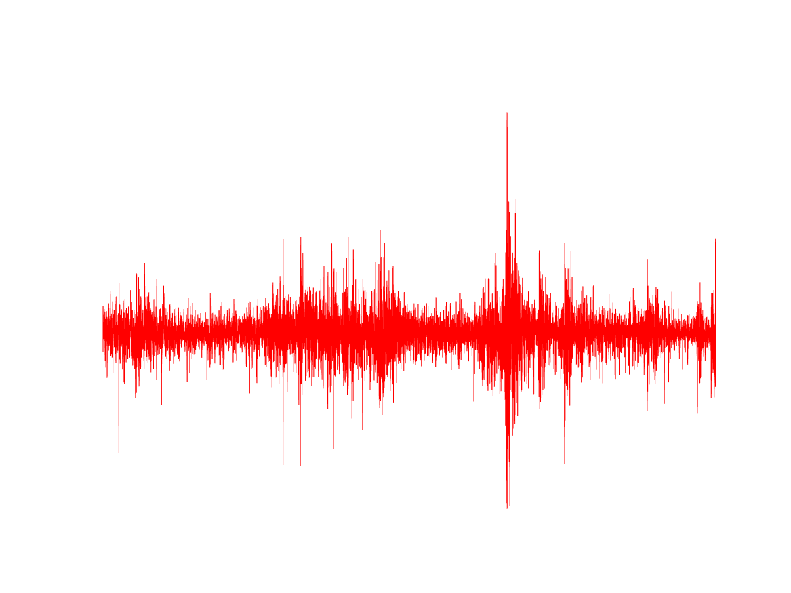
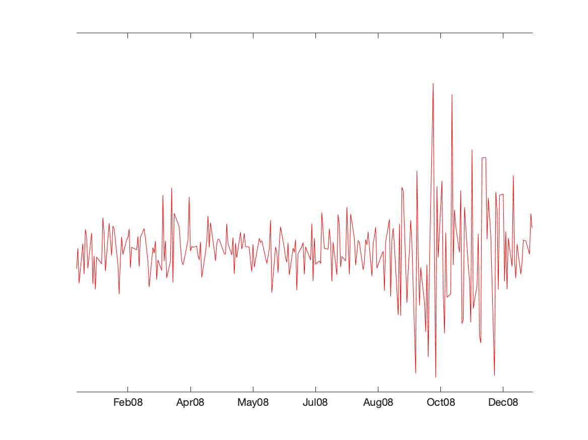
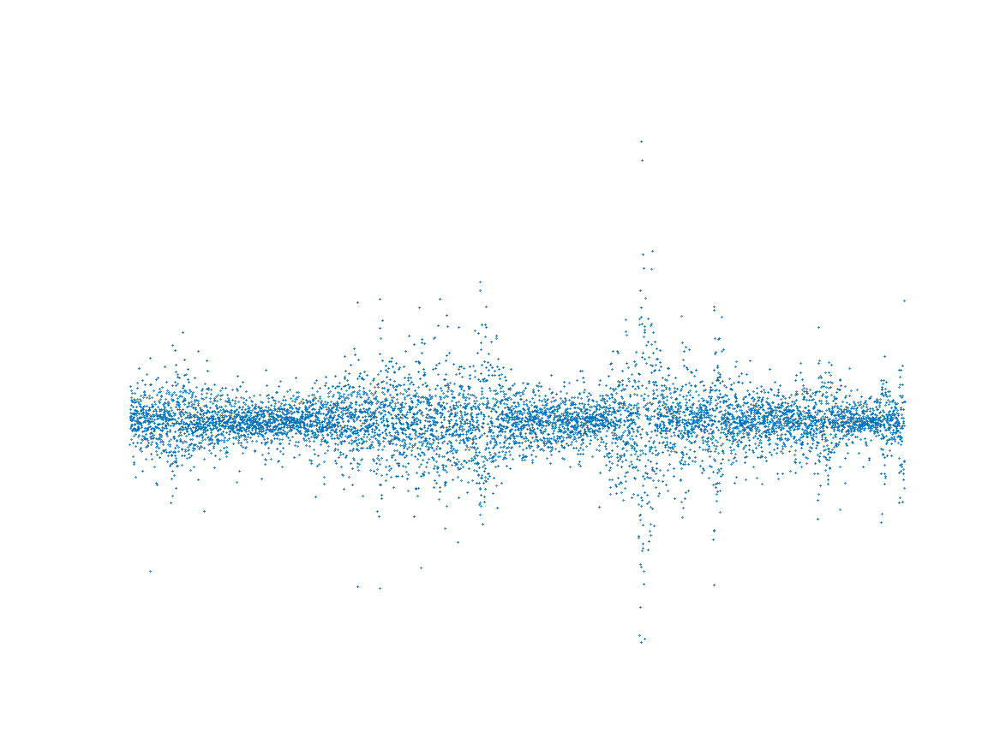
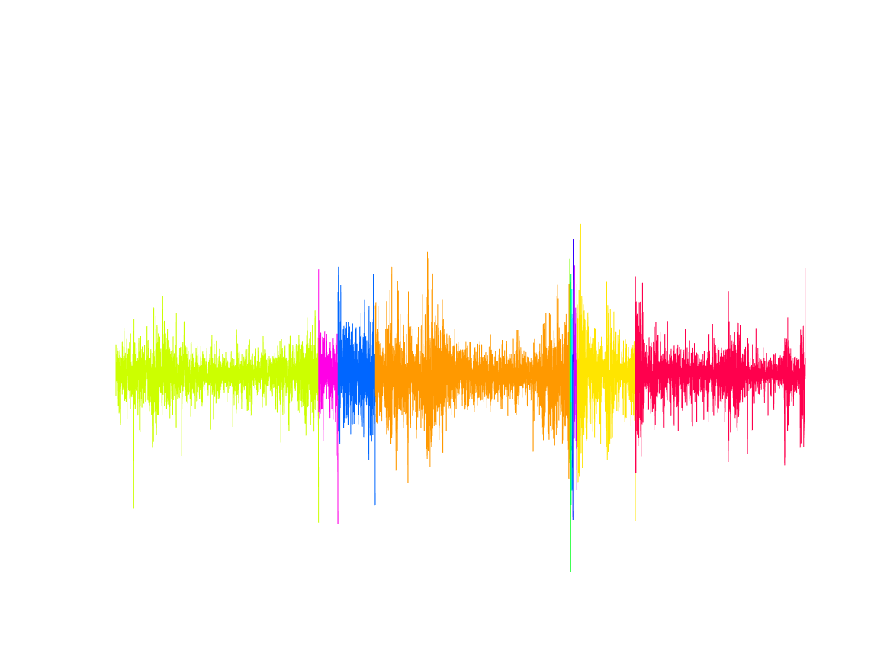

[](http://quantlet.de/)

## [](http://quantlet.de/) **MST_sp500** [](http://quantlet.de/)

```yaml

Name of Quantlet: 'MST_sp500'

Published in: 'Quantinar'

Description: 'Give an example of minimum spanning tree, using S&P 500 index for clustering.'

Submitted:  '18 Oct 2022'

Keywords: 
- 'Minimum Spaning Tree'
- 'S&P 500 index'

Author: 
- 'Zijin Wang'
- 'Wolfgang Karl Härdle'
- 'Rui Ren'

```










### MATLAB Code
```matlab

%% load SP500 TiME SERIES 
clc,clear
load("sp500.mat");
logret=sp500.Return;
timeline=sp500.Time;
price=sp500.IndexPrice;

%% plot scatter price and return
figure;
subplot(2,1,1);
scatter(timeline,price,0.3,MarkerEdgeColor=[0,0.5,0.5])
dateaxis('x',12);
xlim([timeline(1),timeline(end)]);
set(gca,'color','none','ytick',[],'yticklabel',[]);
subplot(2,1,2);
scatter(timeline,logret,0.3)
dateaxis('x',12);
xlim([timeline(1),timeline(end)]);
set(gca,'color','none','ytick',0);

%% save scatter price and return
saveas(gcf,'PriceReturn_SP_scatter','png');

%% plot scatter return
figure;
scatter(timeline,logret,0.3)
dateaxis('x',12);
xlim([timeline(1),timeline(end)]);
set(gca,'color','none','ytick',[],'xticklabel',[],'XColor','none','YColor','none');

%% save scatter return
saveas(gcf,'Return_SP_scatter','png');

%% generate minimal spanning tree
DM=pdist2(logret,logret);
for i=1:length(DM)-2
    for j=i+2:length(DM)
        DM(i,j)=inf;
    end
end
for j=1:length(DM)-2
    for i=j+2:length(DM)
        DM(i,j)=inf;
    end
end
G=graph(DM);
T=minspantree(G,'Method','sparse');
P=[timeline,logret];
T_Edges=sortrows(T.Edges,"Weight");

%% plot png of SP500 MST
figure;
for i = 1:length(T_Edges.Weight)
    plot([P(T_Edges.EndNodes(i,1),1),P(T_Edges.EndNodes(i,2),1)]...
        ,[P(T_Edges.EndNodes(i,1),2),P(T_Edges.EndNodes(i,2),2)],'r',"LineWidth",0.5);hold on
end
dateaxis('x',12);
xlim([timeline(1),timeline(end)]);
set(gca,'color','none','xticklabel',[],'XColor','none','YColor','none')

%% save png of SP500 MST
saveas(gcf,'MST_sp500','png');

%% figure gif of SP500 return by Kruskal
figure;
ax=gca;
% ax.XColor='none';
ax.YColor='none';
hold(ax,'on')
DelayTime=.001;
scatter(timeline,logret,0.3)
dateaxis('x',12);
xlim([timeline(1),timeline(end)]);
pause(DelayTime)
F=getframe(ax);
[imind,cm]=rgb2ind(F.cdata,256);
imwrite(imind,cm,'SP500.gif','gif','Loopcount',inf,'DelayTime',DelayTime);
for i = 1:length(T_Edges.Weight)
    plot([P(T_Edges.EndNodes(i,1),1),P(T_Edges.EndNodes(i,2),1)]...
        ,[P(T_Edges.EndNodes(i,1),2),P(T_Edges.EndNodes(i,2),2)],'r',"LineWidth",0.5);
    if mod(i,100)==0
        pause(DelayTime);saveFrame(ax,DelayTime);
    end
end
pause(DelayTime);saveFrame(ax,DelayTime);

%% used function
function saveFrame(ax,DelayTime)
F=getframe(ax);
[imind,cm]=rgb2ind(F.cdata,256);
imwrite(imind,cm,'SP500.gif','gif','WriteMode','append','DelayTime',DelayTime,"TransparentColor",0);
end


```

automatically created on 2022-10-21