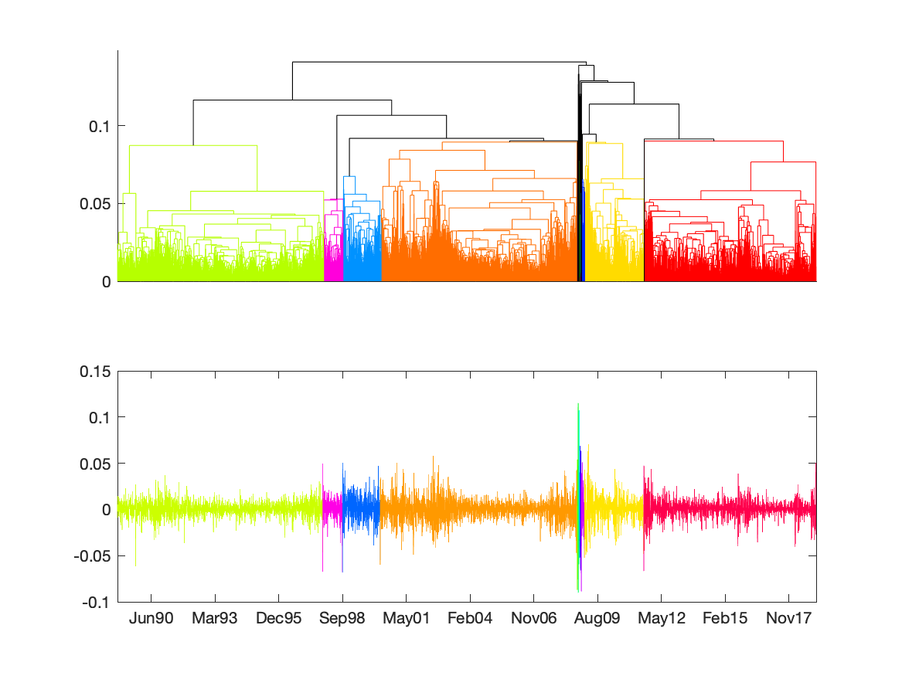

[](http://quantlet.de/)

## [](http://quantlet.de/) **MSTvsHC_sp500** [](http://quantlet.de/)

```yaml

Name of Quantlet: 'MSTvsHC_sp500'

Published in: 'Quantinar'

Description: 'Compare hierarchical clustering and clustering by minimum spanning tree. The data set is S&P 500 index.'

Submitted:  '18 Oct 2022'

Keywords: 
- 'Minimum Spaning Tree'
- 'Hierarchical clustering'
- 'S&P 500 index'

Author: 
- 'Zijin Wang'
- 'Wolfgang Karl Härdle'
- 'Rui Ren'

```



### MATLAB Code
```matlab

%% Hierarchical clustering against MST
clc,clear
load("sp500.mat");
logret=sample(:,4);                % log returns
timeline=datenum(sample(:,1:3));   % time
DM=pdist2(logret,logret);          % distance matrix
for i=1:length(DM)-2               % set dij=inf if |i-j|>1
    for j=i+2:length(DM)
        DM(i,j)=inf;
    end
end
for j=1:length(DM)-2
    for i=j+2:length(DM)
        DM(i,j)=inf;
    end
end
%% generate hierarchical clustering
Z=linkage(squareform(DM)); % default is singleton
%% Hierarchical Clustering
KK=20;
rng default
figure;
subplot(2,1,1);
for K=2:KK
    Kset_HC= ones(K,1);
    [~,T,~]=dendrogram(Z,K);
    for k = 2:numel(Kset_HC)
        Kset_HC(k)=find(T==k,1);
    end
end
[H,T,outperm]=dendrogram(Z,0,"ColorThreshold",Z(end-KK+2,3),"Reorder",1:length(Z)+1);
set(gca,'xtick',[],'xticklabel',[]);
%% MST Clustering
G=graph(DM);                           % generate graph of distance matrix
T=minspantree(G,'Method','sparse');    % MST 
T1.Edges=sortrows(T.Edges,2);          % sort edges by distance
Kset_MST=sort([1;T1.Edges.EndNodes(end-KK+2:end,2)]);
NodesStart=[1;sort(T1.Edges.EndNodes(end-KK+2:end,2))];
NodesEnd=[sort(T1.Edges.EndNodes(end-KK+2:end,1));max(T1.Edges.EndNodes(:,2))];
%% color
cmap = hsv(20);
cmap([1,2,3,4,18,5,13],:) = cmap([5,18,13,3,4,1,2],:);
% cmap = hsv(KK);
% cmap([1,2,3,4,18],:) = cmap([5,18,13,3,4],:);
%% plot MST Clustering
subplot(2,1,2);
plot(timeline(NodesStart(1):NodesEnd(1)),logret(NodesStart(1):NodesEnd(1))...
        ,"Color",cmap(1,:));hold on
for i=2:KK
    plot(timeline(NodesEnd(i-1):NodesEnd(i)),logret(NodesEnd(i-1):NodesEnd(i))...
        ,"Color",cmap(i,:));
    hold on
end
xlim([timeline(1),timeline(end)]);
dateaxis('x',12);
%% save png of MST Clustering
saveas(gcf,'HierarchicalvsMST_0','png');
```

automatically created on 2022-10-21